#一，图灵机的产生（解决数学危机时的意外收获？）

##混乱的数学基础-1900~1930由数学危机引发的对数学基础的研究

1900年左右，数学界出现了各种悖论，尤其是集合论中的罗素悖论，在人们刚刚想到用集合论重构整个数学大厦之时，再次基础崩溃！（第三次数学危机）。

许多数学家开始关心数学的基础问题。 数是什么？ 无穷是什么？ 功利应该如何？ 空间应该如何？直观是否靠得住？
当时的基础研究主要来源于四大支脉，它们彼此交叉：

- 数学的理论以及空间或其他对象的理论。
- 集合及无穷或超穷数的理论，连续统理论。（康托尔一人创造）
- 公理理论。 1899年希尔伯特的《几何基础》出版，是这个方向的里程碑。此后形成数学各领域中的公理化热潮，集合论也不例外。
- 形式逻的符号化与数字化

在这里我们着重介绍一下公理理论。

##几何基础和公理理论：

早期的几何学基础是欧几里得的《几何原本》所奠定的。但欧几里得体系由这许多缺陷。 有些公理多余，许多概念诉诸直观。

希尔伯特在一些人的影响下，提出来“在一起几何学我们可以用桌子，椅子，啤酒杯来代替点，线，面”，这种思想后来导致他完成了几何学基础的彻底革新。

1899希尔伯特发表的《几何基础》不仅彻底清除了耳机里的几何学的缺陷，建立了新的几何学基础，而且数理了现代数学的公理化模式，发展了公理学，推动了整个数学基础的研究。 公理化的要点在于：

- 提出以下原始的术语，这些术语，并不作为定义。
- 原始术语的性质只有公理所反映出来的性质决定。
- 公理系统中的每一公理是否符合人们的直观不予考虑，人们关心的知识公理系统中的公理是否彼此之间没有矛盾，也就是相容性。

希尔伯特的公理系统是非常适合开展一个几何理论的。因此希尔伯特不仅为欧几里得几何学奠定了新的公理化基础，更重要的是建立一套模式来处理任何数学对象，并把他们建立在可靠的公理基础上。他还明确提出对公理系统的要求：

- 无矛盾性，也称为协调性，一致性，相容性，也就是公理系统不能推出相互矛盾的结论。
- 独立性，也就是公理系统中没有一个公理可由其它公理推出（正交性？）
-  （关于完备性和范畴性请才看相关资料）

##希尔伯特计划-用公理化拯救数学大厦

20世纪初，由于悖论的出现，数学的基础产生危机，以布劳威尔为代表的直觉主义主张抛弃经典数学中不可构造的结果，从而引起希尔伯特保卫经典数学“有成效的概念结构和推理方法”的努力；其结果就是提出“希尔伯特计划”
最终目的就是证明经典数学的无矛盾性，因而是可靠的。

希尔伯特认为每一门数学理论都是由一些公理触发的演绎系统。数学理论的可靠性在于公理系统的无矛盾性。证明数学理论无矛盾性常用划归的方法，例如把非欧几何学的无矛盾性归结为算数的无矛盾性，算术的无矛盾性归结为集合论的无矛盾性等。如果最后能完成这些无矛盾性的证明，则整个数学也就有了可靠的基础。这就需要一个绝对的证明！

##哥德尔不完备性定理-数学完全形式化的失败，新时代的开启

一开始，“希尔伯特计划”去取得部分成功，如证明命题演算，一阶谓词演算，只具有加法额算术的无矛盾性。但是1931年，戈特尔证明了不完备性定理，使“希尔伯特计划”收到沉重的打击。

希尔伯特在他的计划中希望能够找到一个形式系统，它能够推导出所有的数学真命题，且只推导出这些真命题，也就是这个形式系统既无矛盾又完备。其重要的组成部分是证明包含数论的形式系统的无矛盾性。哥德尔在试图解决这个问题的过程中，发现并证明了他的不完备性定理。

哥德尔的定理使“希尔伯特计划”归于失败。

-  “希尔伯特计划”原打算把所有古典数学，至少是其中大部分内容形式化。哥德尔第一不完备性定理证明这是不可能的。
-   “希尔伯特计划”还试图通过有穷的证明来证明这样的形式系统的无矛盾。哥德尔第二不完备性定理表明，即使形式数论的所有方法都看成是有穷的，也不足以证明数论的无矛盾性。

哥德尔的论文发表之后，立即引起逻辑学家的莫大兴趣，它开始虽然诗人感到惊异不解，不就即得到广泛承认，并产生了巨大的影响。它是20世纪数学的最重大成就之一，它是数理逻辑发展史上的里程碑。使得数理逻辑发展成“四论”，即递归论，证明论，公里集合论，模型论组成的数学分支。

##可计算性问题 - 一个哥德尔不完备性定理的副产品却导致图灵机的产生（人类意外打开信息时代的大门？）

>哥德尔的研究工具 -- 递归函数促进了递归函数论的系统研究，同时推动了不可判定性问题的研究（递归论的新分支开始出现。）

什么是可计算性问题？

哥德尔不完备性定理说不存在一个完备的系统把数学彻底形式化。因为总有一些问题是既不可以证明“真”，也不可以证明“假”的。 

有些数学家看到这里会思考一个问题： 哪些问题是可证明的？哪些问题是不可证明的？ 边界在哪？ 怎么判定一个问题是否可解？

对应的到计算上：

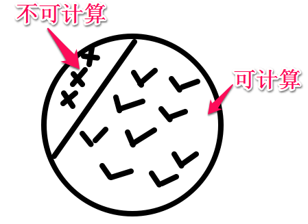

可计算性严格定义：
设函数f的定义域是D，值域是R，如果存在一种算法，对D中的任意给定x，都能计算出f(x)的值，则称函数f 是可计算的。

通俗解释： 可计算就是在可以预先确定的时间和步骤之内能够具体进行的计算。

可计算的研究思路：
为计算建立一个数学模型，成为计算模型，然后证明凡是这个计算模型能够完成的任务都是可计算的任务。（这个模型就像一个评价器，判定那些问题可解那些不可解）。

图灵提出了一个模型 -- 图灵机

1936年，图灵在其著名论文《论可计算数在判定问题中的应用》一文中提出来一种理想的计算性的数学模型-图灵机。（图灵试图将可证明问题规约为可计算数问题？）（顺便插一句，在那之后，图灵在1950年提出了著名的“图灵测试”，同年10月发表论文“机器能思考吗？”，开启人工智能的研究）

#二，图灵机介绍 （构成？工作方式？停机问题？）

*声明：以下内容来自 北京大学 李戈老师的《计算概论A》课件 课程地址 https://www.coursera.org/course/pkuic 课程内容如有变化请移步我的私人备份： 链接:http://pan.baidu.com/s/1dDyEulz 密码: t422 *

##图灵机的构成

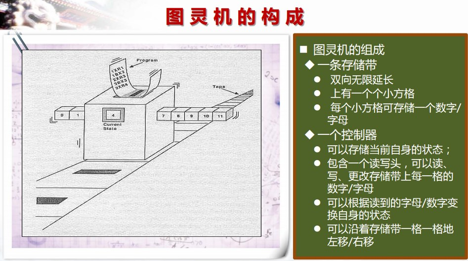

##图灵机工作方式

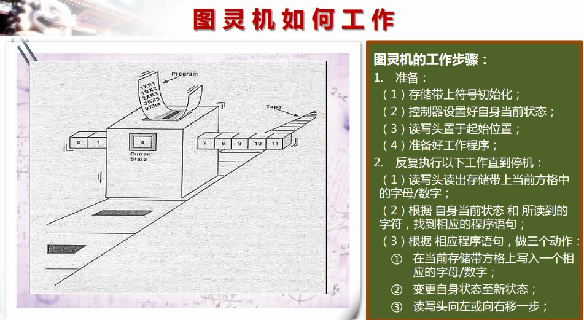

示例：

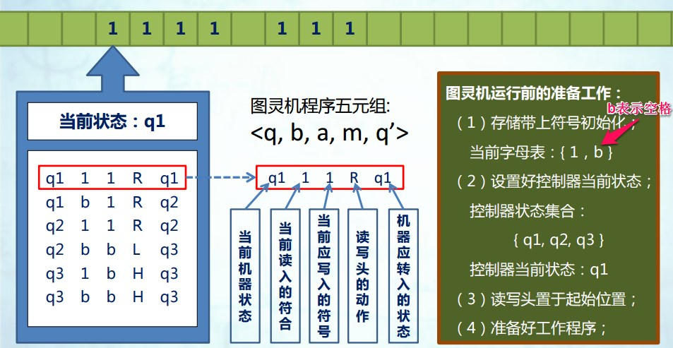

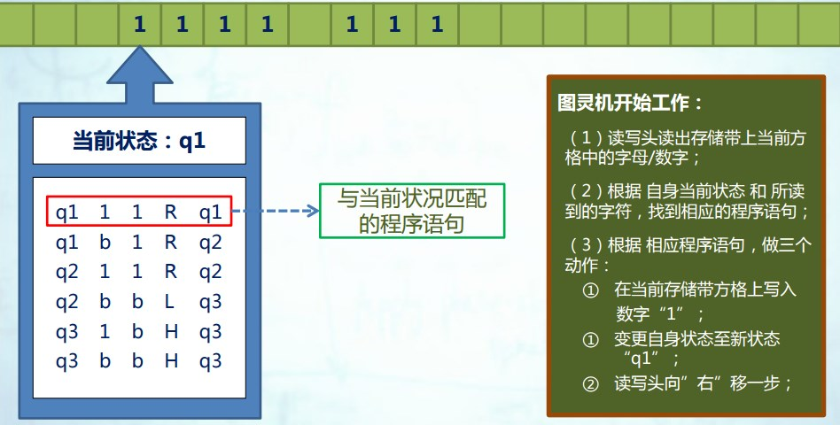

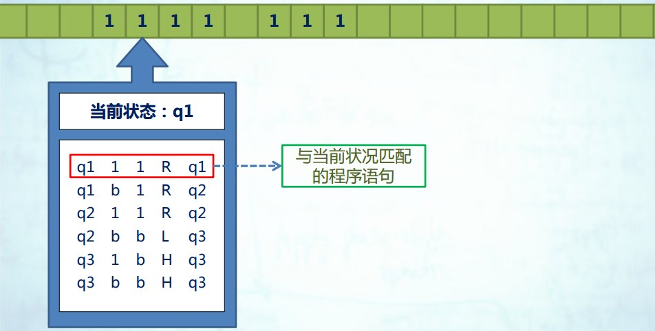

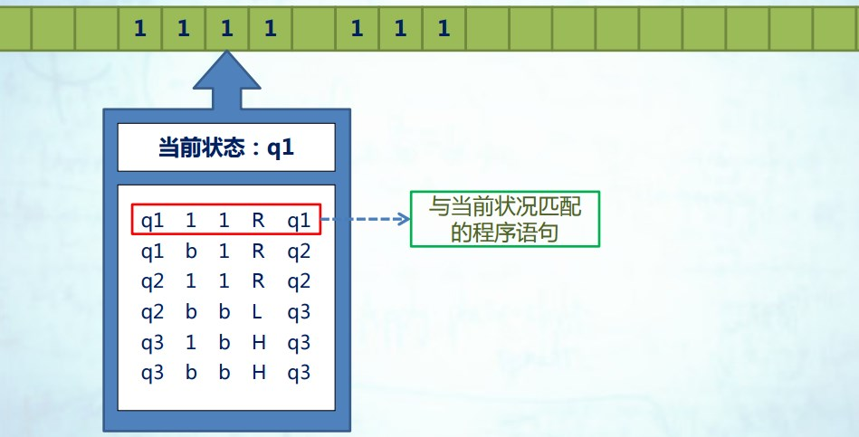

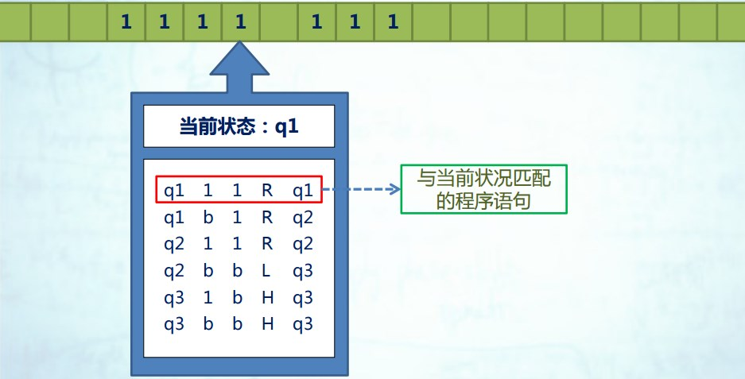

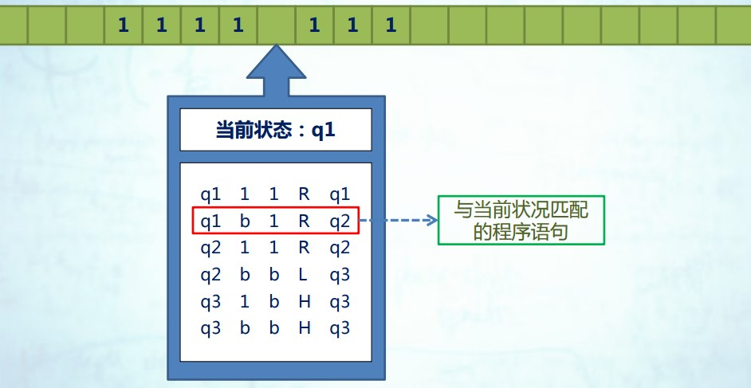

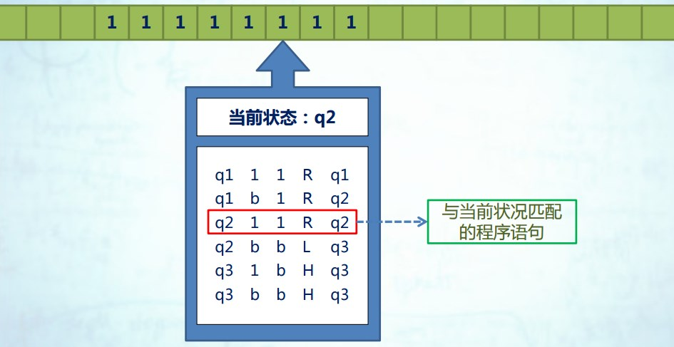

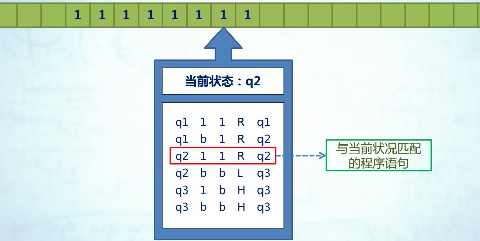

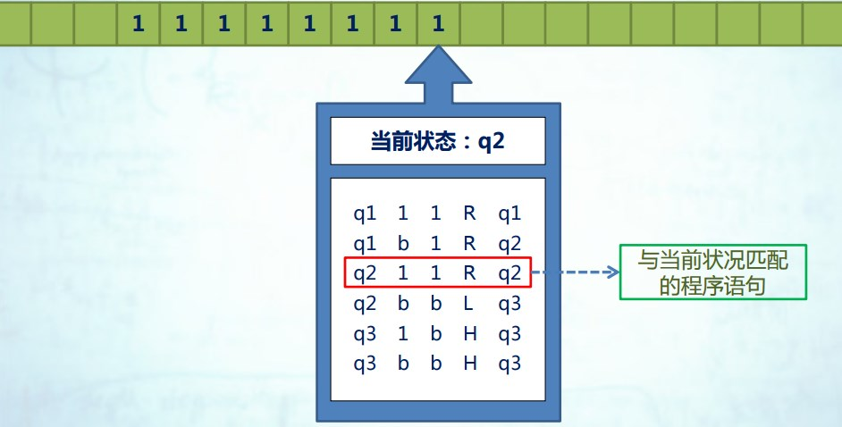

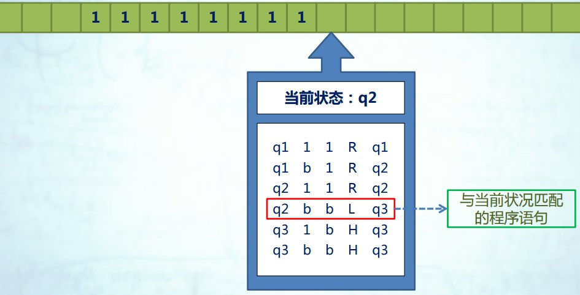

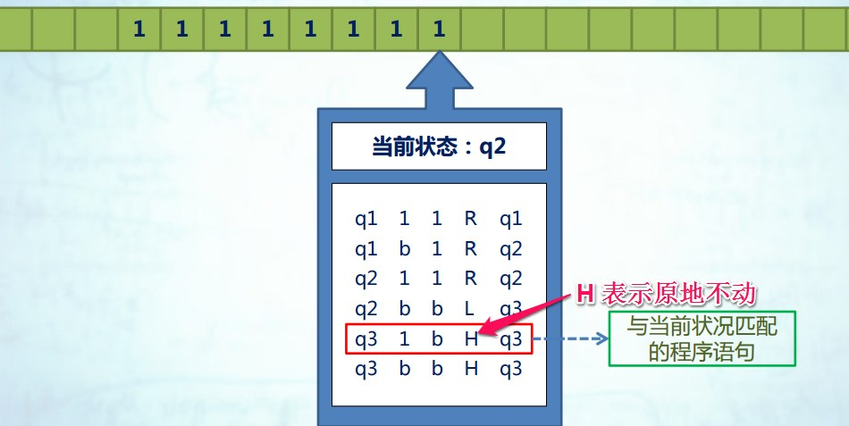

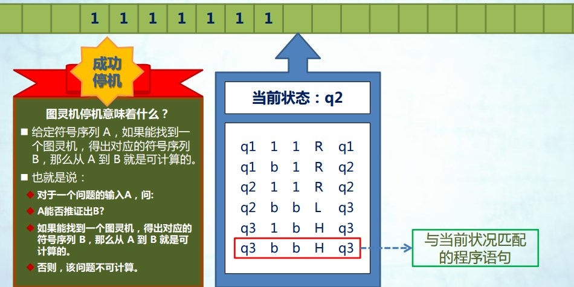

##图灵机为什么受到重视？ 

可计算模型有很多，但是图灵机却拥有 简单！ 强大！ 可实现！的强大特点。

下图网址里有图灵机的具体实现：

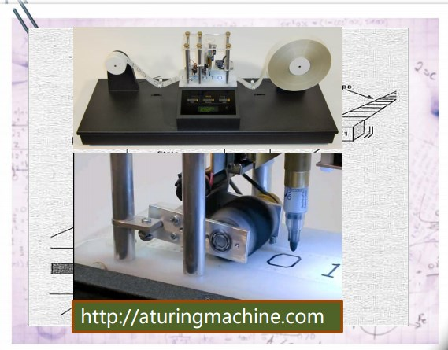

#图 灵 机 的 理 论 意 义

- 可计算性的判定；
- 意义： 
    - 给出了一个可实现的通 用计算模型； 
    -引入了通过“读写符号” 和“状态改变”进行运 算的思想；
    - 证实了基于简单字母表 完成复杂运算的能力； 
    - 引入了存储区、程序、 控制器等概念的原型；

---
参考资料：

[计算概论A](https://www.coursera.org/course/pkuic)

[数学是什么](http://book.douban.com/subject/3163838/)

